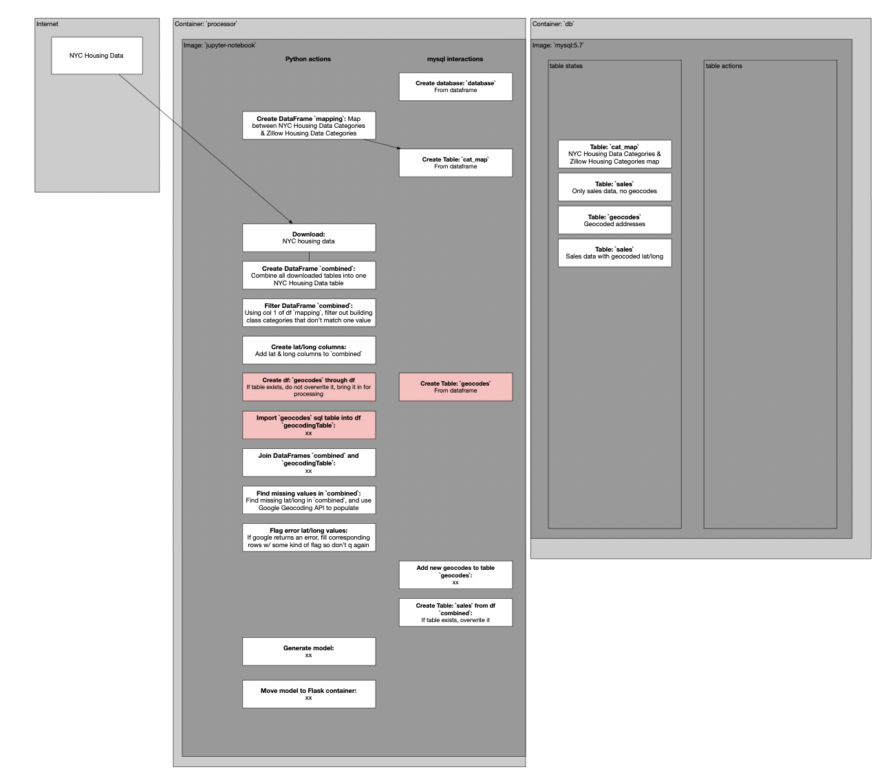

# What is this project?

Welcome to my real estate predictor API project! I built this API to make predictions of New York City real estate easily accessible to anyone.

I am not just hosting an instance of the API myself; I made it easy for you to launch your own instance, pull the training data, train the model, and deploy the model as an API that you can use in your own application.

# Motivation

This is a product of my ongoing fascination with real estate tools, specifically real estate tools with an element of GIS.

Previous projects have mostly drawn from my data-science and scientific computing background, based Python and Mathematica. For this project, I wanted to start to tangle with web technologies; I wanted to build with tools like Terraform, Docker, Flask, etc.

So, instead of just publishing a notebook to download the housing data and build the predictor, I wanted to make a tool that anyone could use to analyze real estate.

I have future plans to build a chrome extension that uses responses from this API to inject sales price predictions into Zillow’s housing listings web pages.

# Get it up and running for yourself

Here’s a walkthrough of how to get an instance of the API up and running for yourself on an AWS EC2 instance. I tried to make this as low-effort as possible, using tools like Terraform to get you up and running quickly.

### **Set up a user account with Amazon AWS…**

**Navigate to AWS’s `Identity and Access Management` console (search for `IAM`)…**


**Hit the `Users` button in the sidebar and click the `Add users` button, and follow the user flow to user creation…**


**Create a new user group with `AdministratorAccess` privileges and add your user to that group…**


**Your console should look something like this…**


Click on your new user in the `Users` section, scroll down to the `Security credentials` tab, and hit `Create access key`. Then, select `Third-party service`.


Type in a short description…


And then copy / paste your access keys to a secure location. You’ll need them!


### Install Terraform and provision a server

This script will download another script from this Github repo, and set up Terraform on your local machine.

```bash
curl -o main_local.sh https://raw.githubusercontent.com/jackzellweger/real-estate-predictor/main/main_local.sh && sudo chmod +x ./main_local.sh && sudo ./main_local.sh
```

# Log into your server & launch the API

I used a `t2.xlarge` AWS EC2 instance running Debian, so I can’t guarantee this set-up script will work on any other OS.

**The script you’ll run to SSH into the server will look something like this…**

```bash
ssh -i key-pair.pem admin@ec2-xx-xxx-xxx-xxx.compute-x.amazonaws.com
```

Where you replace `key-pair.pem` and `admin@ec2-xx-xxx-xxx-xxx.compute-x.amazonaws.com` with information you obtain from your AWS EC2 dashboard where it says `Public IPv4 DNS`.

You might have to run the following command on your key pair `.pem` if you run into any errors when running the above script.

```bash
chmod 400 /path/to/your/key-pair.pem
```

**Run the following shell script on a server running Debian. You can just copy & paste that in!** 

```bash
cd ../..//opt && \
sudo chown admin /opt && \
sudo apt upgrade -y && \
sudo apt-get update -y && \
sudo apt-get install git -y && \
sudo git clone https://github.com/jackzellweger/real-estate-predictor.git && \
cd real-estate-predictor && \
sudo chmod +x ./main.sh && \
sudo ./main.sh
```

### Secrets & credentials

You’re going to be prompted for the following information when the installation scripts are finished building. This will build a `config.py` file where we’ll keep your secrets. 

```bash
Please enter your Google API Key:
Please enter your database username:
Please enter your database password:
Please enter your database name:
```

Just remember to add your `config.py` to your `.gitignore` if you fork this project!

If you want to overwrite this information with a new API key or new database information, you can run the `reset_config.sh` script in the `real-estate-predictor` directory.

**Keep in mind that running the main data processing script could consume a lot of Google Cloud API resources.** To build the initial geocoding table, the script consumed almost $200 of calls.

# Developing on the EC2 instance

### Working in on the jupyter-notebook on the server

You can then develop on the jupyter notebook on the sever by running the following command on your local machine…

```bash
ssh -i key-pair.pem -L 8889:localhost:8888 admin@ec2-xx-xxx-xxx-xxx.compute-1.amazonaws.com
```

Where of course, you change `admin@ec2-xx-xxx-xxx-xxx.compute-1.amazonaws.com` according to your own server…

### Changing the Flask server app

And you can change the Flask server by modifying the `flask_app.py` directly on the server and restarting the docker container that holds it with the following command…

```bash
docker-compose restart flask-server
```

# How it works

### The tech stack

- **Terraform**: I used Terraform to rapidly provision and manage my AWS EC2 instances, allowing for fast iteration during development.
- **Docker / Docker Compose**: I tried to implement a separation of concerns within the application, separating each service into its own container. I used three containers:
    - A data processor, called `processor`, that
    - A MySQL database called `db`
    - A flask server called `flask-server`
- **Python**: The main language used for the backend. I chose it because I am super familiar with its data libraries and wanted to learn how about its machine learning capabilities. I used several libraries, including all the standard libraries like `numpy`, `matplotlib`, `pandas`, etc. I also used some libraries I was not familiar with. For example, `sqlalchemy` to interact with my SQL database, and `scikit-learn` & `joblib` to train and package a random forest model.
- **Flask**: I used Flask to set up the API that serves the price predictor.
- **MySQL:** I used MySQL to store geocoding and sales data in the `db` docker container.

### Data sources

After looking far and wide for a data source that could give me the price of every house in the country, I decided that was unfeasible, and narrowed my scope to just encompass New York City. A fter researching the enormity of the datasets involved, and the cost of training a model that large, the right choice was obvious!

I found a great dataset that New York City publishes called `The Department of Finance’s Rolling Sales`, which lists a complete year of sales data, periodically updated, with new records entering at the top, and older entries dropping off the bottom.

### Planning & design process

