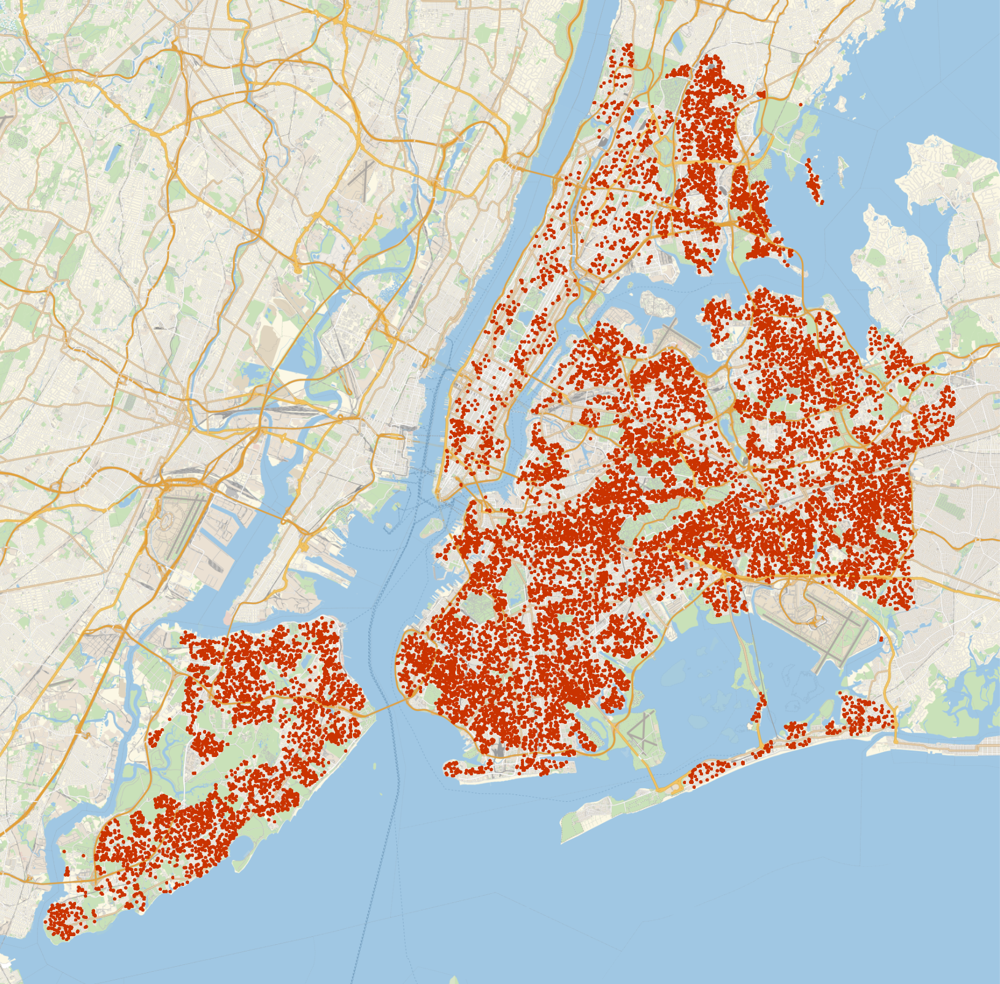

# What is this project?

Welcome to my real estate predictor API project! I built this API to make predictions of New York City real estate easily accessible to anyone.

I am not just hosting an instance of the API myself; I made it easy for you to launch your own instance, pull the training data, train the model, and deploy the model as an API that you can use in your own application.

I made everything so it’s as easy as possible for the end user to get started.

# Motivation

This is a product of my ongoing fascination with real estate tools, specifically real estate tools with an element of GIS.

Previous projects have mostly drawn from my data-science and scientific computing based background in Python and Mathematica. For this project, I wanted to start to tangle with web technologies; I wanted to build with tools like Terraform, Docker, Flask, etc.

So, instead of just publishing a notebook to download the housing data and build the predictor, I made a tool that anyone could integrate into their app or workflow to analyze real estate.

I have future plans to build a Chrome extension that uses responses from this API to inject sales price predictions into Zillow’s housing listings web pages.

# Get it up and running for yourself

Here’s a walkthrough of how to get an instance of the API up and running for yourself on an AWS EC2 instance. I tried to make this as low-effort as possible, using tools like Terraform to get you up and running quickly.

### **Set up a user account with Amazon AWS…**

**Navigate to AWS’s `Identity and Access Management` console (search for `IAM`)…**

<div align="center">
    
</div>

**Hit the `Users` button in the sidebar and click the `Add users` button, and follow the user flow to user creation…**

<div align="center">
    
</div>

**Create a new user group with `AdministratorAccess` privileges and add your user to that group…**

<div align="center">
    
</div>

**Your console should look something like this…**

<div align="center">
    
</div>

Click on your new user in the `Users` section, scroll down to the `Security credentials` tab, and hit `Create access key`.

Then, select `Third-party service`.

<div align="center">
    
</div>

Type in a short description…

<div align="center">
    
</div>

And then copy / paste your access keys to a secure location. You’ll need them!

<div align="center">
    
</div>

### Install Terraform and provision a server automatically (with Terraform)

This script will download another script from this Github repo, and set up Terraform on your local machine.

```bash
curl -o main_local.sh https://raw.githubusercontent.com/jackzellweger/real-estate-predictor/main/main_local.sh && sudo chmod +x ./main_local.sh && sudo ./main_local.sh
```

## Provision a Server with Terraform and Run a Real Estate Predictor

### Automatically Install Terraform and Provision a Server (with Terraform)

This script downloads another script (`main_local.sh`) from a GitHub repository and sets up Terraform on your local machine. The `main_local.sh` script is intended to automate the server provisioning process.

```bash
curl -o main_local.sh https://raw.githubusercontent.com/jackzellweger/real-estate-predictor/main/main_local.sh && sudo chmod +x ./main_local.sh && sudo ./main_local.sh
```

**If the script executed successfully, you can skip the manual provisioning section.** 

### Manually Provision a Server (without Terraform)

If you encounter issues with the above script, follow these steps to install Terraform and set up your server manually.

**1. Install Homebrew**

We'll be using Homebrew to install Terraform. Run the following command in your local machine’s shell:

```bash
/bin/bash -c "$(curl -fsSL https://raw.githubusercontent.com/Homebrew/install/HEAD/install.sh)"
```

**2. Install Terraform using Homebrew**

```bash
brew tap hashicorp/tap && brew install hashicorp/tap/terraform
```

**3. Set AWS Access Key Environment Variables**

These environment variables only apply to the current shell, so if you restart your shell, you’ll need to run this command again before working with Terraform.

🗒️ *Note: For security reasons, do not share your AWS keys. Instead, replace **`(your access key)`** and **`(your secret access key)`** with your own AWS keys.*

```bash
export AWS_ACCESS_KEY_ID=(your access key) && export AWS_SECRET_ACCESS_KEY=(your secret access key)
```

**4. Create a Terraform File**

Create a new directory for your project (e.g., on the Desktop), navigate to it with `cd`.

```bash
mkdir ~/Desktop/myproject && cd ~/Desktop/myproject
```

Then run the following command in your terminal to create a `main.tf` file:

```terraform
cat > main.tf <<EOF
provider "aws" {
  region = "us-east-2"
}

resource "aws_instance" "example" {
  ami           =  "ami-08eda224ab7296253" 
  instance_type = "t2.xlarge"
  tags          = {
    Name = "real-estate-predictor"
  }
}
EOF
```

You can customize the `region` and `instance_type` parameters as needed.

**5. Initialize Terraform**

While in the directory with your `main.tf` file, run the following…

```bash
terraform init
```

### Log into Your Server & Launch the API

🗒️ *Note: This tutorial is based on a **`t2.xlarge`** AWS EC2 instance running Debian. If you are using a different OS, please adjust the commands accordingly.*

After successfully creating and starting your EC2 instance using Terraform, use SSH to log into the server:

```bash
ssh -i key-pair.pem admin@ec2-xx-xxx-xxx-xxx.compute-x.amazonaws.com
```

Replace `key-pair.pem` and `admin@ec2-xx-xxx-xxx-xxx.compute-x.amazonaws.com` with your own AWS EC2 information (on the dashboard under the `Public IPv4 DNS` label).

If you encounter errors, you may need to modify the permissions for your key pair file:

```bash
chmod 400 /path/to/your/key-pair.pem
```

**Set up the Server**

Copy and paste the following commands on your server:

```bash
cd ../..//opt && \
sudo chown admin /opt && \
sudo apt upgrade -y && \
sudo apt-get update -y && \
sudo apt-get install git -y && \
sudo git clone https://github.com/jackzellweger/real-estate-predictor.git && \
cd real-estate-predictor && \
sudo chmod +x ./main.sh && \
sudo ./main.sh
```

### Input Secrets & Credentials

After the installation scripts have finished building, you will be prompted to enter the following information. This will build a `config.py` file to store your secrets:

```
Please enter your Google API Key:
Please enter your database username:
Please enter your database password:
Please enter your database name:
```

If you want to update this information later, run the `reset_config.sh` script in the `real-estate-predictor` directory.

🗒️ *Note: Remember to add your `config.py` to your `.gitignore` if you fork this project!*

⚠️ *Warning: Running the main data processing script could consume a significant amount of Google Cloud API resources. To build the initial geocoding table, the script consumed almost $200 of calls.*

### Developing on the EC2 Instance

**Develop on the Jupyter-Notebook Server**

You can develop on the Jupyter notebook server by running the following command on your local machine:

```bash
ssh -i key-pair.pem -L 8889:localhost:8888 admin@ec2-xx-xxx-xxx-xxx.compute-1.amazonaws.com
```

Replace `admin@ec2-xx-xxx-xxx-xxx.compute-1.amazonaws.com` with your own server information.

**Modify the Flask Server App**

You can modify the Flask server by editing the `flask_app.py` directly on the server. After making changes, restart the Docker container that holds it with the following command:

```bash
docker-compose restart flask-server
```

# Technical details

### Design patterns & structure

This project has been structured to encapsulate the code as much as possible. All the data required for initialization of tables and analysis are passed as parameters into functions declared in a separate file.

The project adheres to a test-driven development (TDD) approach as much as possible, where each component is described in terms of fully-encapsulated modules that accomplish their own part in launching and serving the API. Each of these components takes in data in a specific format and outputs data in a new format.

### The tech stack

- **Terraform** : I used Terraform to provision and manage AWS EC2 instances, allowing for faster iteration during development.
- **Docker / Docker Compose** : A separation of concerns was implemented within the application, separating each service into its own container. There are three main containers in the system:
    - `processor`: This service is responsible for consuming raw data, processing it, and creating two outputs: an encoder and a predictive model. These outputs are crucial for the predictive capabilities of the system.
    - `db`: This MySQL database stores both the geocoding information and the processed data for the sales that will be used for the predictions.
    - `flask-server`: This container hosts the Flask server, which sets up an API to serve the price predictor model and handles requests from the users.
- **Python** : The primary language I used for the backend. It was chosen due to familiarity with its data and machine learning libraries. I used libraries like `numpy`, `matplotlib`, `pandas`, `sqlalchemy`, `scikit-learn`, and `joblib`.
- **Flask** : I used Flask to create a lightweight web server to serve the API for the price prediction model.
- **MySQL:** A MySQL instance was set up to store geocoding and sales data.

### The boundaries of the Docker containers

I used Docker to isolate the main processes that the application performs…

**The program uses three services…**

1. `processor`: This docker container processes government data into a format suitable for training the predictive model. The output of this process is a predictive model and an encoder which are saved on the `model_volume` volume. This allows the `flask-server` service to access the resources when needed.
2. `flask-server`: This container hosts the Flask server which serves the price predictor model via an API. It interacts with both the `db` and `processor` services, and also accesses the `model_volume` to serve predictions.
3. `db`: This MySQL database stores the geocoded address data along with processed sales data.

**The program uses two volumes…**

1. `db_data`: This volume stores the geocoded address data and any processed data that needs to be persistent for the `db` service.
2. `model_volume`: This volume stores the predictive model created by the `processor` service. This allows the model to be shared between the `processor` and `flask-server` services.

**Here’s a more detailed view of the system…**


In this diagram, I tried to make the flow of data as clear as possible. The `processor` service reads data from `db`, processes it, and then writes the results to `model_volume`. The `flask-server` service reads from `model_volume` as needed to handle user requests.

# Combine multiple DataFrames in an array into one:
`combineHousingDataSets()`

I took the messy code from my notebook, modularized it into a function, and tested the function to ensure it returns what we expect when we’re passing bad data.

### Data Sources

After looking far and wide for a data source that could give me the price of every house in the country, I decided that was unfeasible, and narrowed my scope to just encompass New York City. After researching the enormity of the datasets involved, and the cost of training a model that large, the right choice was obvious! I’d build a predictor for the narrower-domain of New York City only.

I found a great dataset that New York City publishes called `The Department of Finance’s Rolling Sales`, which lists a complete year of sales data, periodically updated, with new records entering at the top, and older entries dropping off the bottom.

The [New York City Rolling Sales Data](https://www.nyc.gov/site/finance/taxes/property-rolling-sales-data.page) website provides about ~20 features on every sale that’s happened in the last year. 

My eventual goal was to build some kind of easily accessible API where one can provide some of this information, and get back a predicted house price. For example, there are some features, like `TAX CLASS`, `EASEMENT`, and `LOT` that won’t be very useful to the average user. 

```python
In [xx]: data[0].columns
--
Index(['BOROUGH', 'NEIGHBORHOOD', 'BUILDING CLASS CATEGORY',
       'TAX CLASS AT PRESENT', 'BLOCK', 'LOT', 'EASEMENT',
       'BUILDING CLASS AT PRESENT', 'ADDRESS', 'APARTMENT NUMBER', 'ZIP CODE',
       'RESIDENTIAL UNITS', 'COMMERCIAL UNITS', 'TOTAL UNITS',
       'LAND SQUARE FEET', 'GROSS SQUARE FEET', 'YEAR BUILT',
       'TAX CLASS AT TIME OF SALE', 'BUILDING CLASS AT TIME OF SALE',
       'SALE PRICE', 'SALE DATE'],
      dtype='object')
```

On top of that, my eventual goal in building this API is to make it available to a Chrome extension I’m building, which will take information from Zillow listings, send it to this price prediction API, and then display the predicted price on the Zillow web page itself.

The categories that NYC provides, and the categories that Zillow provides have a lot of overlap. The fields that didn’t overlap I decided I could live without. However, there was one field I wanted as a feature in my prediction that didn’t overlap.

The feature I was interested in was the kind of property. NYC labeled this feature as `BUILDING CLASS CATEGORY`, with categories like `01 ONE FAMILY DWELLINGS` and `07 RENTALS - WALKUP APARTMENTS`

Here is a look at the unique entries in the `BUILDING CLASS CATEGORY` column…

```python
In[x]: data[1]['BUILDING CLASS CATEGORY'].unique()
--
array(['01 ONE FAMILY DWELLINGS', '02 TWO FAMILY DWELLINGS',
       '03 THREE FAMILY DWELLINGS', '05 TAX CLASS 1 VACANT LAND',
       '07 RENTALS - WALKUP APARTMENTS', '10 COOPS - ELEVATOR APARTMENTS',
       '21 OFFICE BUILDINGS', '22 STORE BUILDINGS', '27 FACTORIES',
       '29 COMMERCIAL GARAGES', '30 WAREHOUSES',
       '31 COMMERCIAL VACANT LAND', '32 HOSPITAL AND HEALTH FACILITIES',
       '33 EDUCATIONAL FACILITIES', '38 ASYLUMS AND HOMES',
       '41 TAX CLASS 4 - OTHER', '04 TAX CLASS 1 CONDOS',
       '06 TAX CLASS 1 - OTHER', '08 RENTALS - ELEVATOR APARTMENTS',
       '26 OTHER HOTELS', '44 CONDO PARKING',
       '09 COOPS - WALKUP APARTMENTS', '12 CONDOS - WALKUP APARTMENTS',
       '14 RENTALS - 4-10 UNIT', '37 RELIGIOUS FACILITIES',
       '43 CONDO OFFICE BUILDINGS', '13 CONDOS - ELEVATOR APARTMENTS',
       '36 OUTDOOR RECREATIONAL FACILITIES',
       '15 CONDOS - 2-10 UNIT RESIDENTIAL', '17 CONDO COOPS',
       '28 COMMERCIAL CONDOS', '35 INDOOR PUBLIC AND CULTURAL FACILITIES',
       '39 TRANSPORTATION FACILITIES'], dtype=object)
```

There were a ton of irrelevant categories like `22 STORE BUILDINGS` and `27 FACTORIES`. The way we filtered this out was to create a mapping between these categories provided by NYC, and the categories that Zillow likes

So, I built a map between NYC’s data, and some of the [categories](https://www.zillow.com/resources/stay-informed/types-of-houses/) I saw on Zillow’s website. Basically, I assigned a Zillow category to each residential type property I thought would be relevant to our analysis. First, I built a kind of lookup table in the form of a Python dictionary…

```bash
category_mapping = { '01 ONE FAMILY DWELLINGS': 'Single-family home',
                     '02 TWO FAMILY DWELLINGS': 'Duplex',
                     '03 THREE FAMILY DWELLINGS': 'Multi-family home',
                     '14 RENTALS - 4-10 UNIT': 'Multi-family home',
                     '15 CONDOS - 2-10 UNIT RESIDENTIAL': 'Multi-family home',
                     '16 CONDOS - 2-10 UNIT WITH COMMERCIAL UNIT': 'Multi-family home',
                     '08 RENTALS - ELEVATOR APARTMENTS': 'Apartment',
                     '07 RENTALS - WALKUP APARTMENTS': 'Apartment',
                     '04 TAX CLASS 1 CONDOS': 'Condo',
                     '12 CONDOS - WALKUP APARTMENTS': 'Condo',
                     '13 CONDOS - ELEVATOR APARTMENTS': 'Condo',
                     '17 CONDO COOPS': 'Co-op',
                     '09 COOPS - WALKUP APARTMENTS': 'Co-op',
                     '10 COOPS - ELEVATOR APARTMENTS': 'Co-op'
                    }
```

I stored that string in my `helpers.py` file, which is a file I use to store all my static information and functions that help with the processor script.

I used this quick script to generate a new column, `GROUPED CATEGORY`, from the `BUILDING CLASS CATEGORY` column

```python
# Assign impoted variable to a local variable
category_mapping = helpers.category_mapping

# Then, use the map function to create the new column
combined['GROUPED CATEGORY'] = combined['BUILDING CLASS CATEGORY'].map(category_mapping)

# Check if there are any missing values in the new column (i.e., categories that couldn't be mapped)
if combined['GROUPED CATEGORY'].isna().any():
    combined = combined.dropna(subset=['GROUPED CATEGORY'])
    print("Warning: some categories were not be mapped, those rows were dropped.")
```

You can see that we removed any categories not present in our map, thereby removing irrelevant rows in one step.

### Function input & output

**Input:**

- An arbitrary number of `pandas.dataframe` objects.

**Output:**

- One (1) `pandas.DataFrame` object, aggregating all rows from all processed DataFrames a single, unified data structure. The resulting index is reset.

### The code

This is a pretty standard function to combine several `pandas.dataframe` objects into a new one.

```python
def combineHousingDataSets(dataFrames):
    # Define required columns
    REQUIRED_PREPROCESSING_COLUMNS = [
        "BOROUGH",
        "NEIGHBORHOOD",
        "BUILDING CLASS CATEGORY",
        "ADDRESS",
        "LAND SQUARE FEET",
        "GROSS SQUARE FEET",
        "SALE PRICE",
    ]

    # Check to see if columns exist
    for dataFrame in dataFrames:
        # Removes extra spaces in columns
        dataFrame.columns = dataFrame.columns.str.strip()

        # Checks if required columns are present
        for dataFrame in dataFrames:
            if not set(REQUIRED_PREPROCESSING_COLUMNS).issubset(dataFrame.columns):
                # Returns false if they are not
                print(dataFrame)
                return False

    # Combine the dataframes and return a new DataFrame
    return pd.concat(dataFrames, ignore_index=True)
```

### Testing

**Test 1**

Does the function perform as expected when we pass correct data? In this case, one of the DataFrame’s we’re passing has only the 7 columns we want, and the other one has a column called `EXTRA COLUMN`.

We assert that the resulting DataFrame is in-fact, a `pandas.dataframe` object, and that the resulting shape is what we expect given the shape of our input data.

```python
# Passing DataFrame
df1_passing = pd.DataFrame(
    {
        "BOROUGH": ["X", "Y"],
        "NEIGHBORHOOD": ["A", "B"],
        "BUILDING CLASS CATEGORY": ["C1", "C2"],
        "ADDRESS": ["addr1", "addr2"],
        "LAND SQUARE FEET": [100, 200],
        "GROSS SQUARE FEET": [200, 300],
        "SALE PRICE": [1000000, 2000000],
    }
)

# DataFrame with an extra column
df2_extra_column = pd.DataFrame(
    {
        "BOROUGH": ["Z"],
        "NEIGHBORHOOD": ["C"],
        "BUILDING CLASS CATEGORY": ["C3"],
        "ADDRESS": ["addr3"],
        "LAND SQUARE FEET": [300],
        "GROSS SQUARE FEET": [400],
        "SALE PRICE": [3000000],
        "EXTRA COLUMN": ["EXTRA"],
    }
)

# One of the DataFrames has an extra column
def test_combineHousingDataSets_success():
    result = helpers.combineHousingDataSets([df1_passing, df2_extra_column])
    assert isinstance(result, pd.DataFrame)
    assert result.shape == (
        3,
        8,
    )  # the combined DataFrame should have 3 rows and 8 columns
    # because we added a extra column from the original 7
```

**Test 2**

Here, we test to see what happens if one of the `pandas.dataframe` objects we pass has several missing columns. Assume we’ve run the code block from **Test 1**, as we use some of those test DataFrames as well.

```python
# DataFrame with a missing column
df_missing_column = pd.DataFrame(
    {
        "BOROUGH": ["W"],
        "NEIGHBORHOOD": ["D"],
        "ADDRESS": ["addr4"],
        "LAND SQUARE FEET": [400],
        "GROSS SQUARE FEET": [500],
    }
)

# One of the DataFrames passed containes missing columns
def test_combineHousingDataSets_missing_columns():
    assert helpers.combineHousingDataSets(
        [df1_passing, df_missing_column]
        ) == False
```

# Filter outliers: `filterOutliers()`

Sometimes, someone will come along and drop 400 million dollars on an apartment building. I didn’t want to include these kinds of sales in my prediction dataset. I thought it would just muck things up and degrade the quality of the prediction. After all, we are interested in the kinds of homes that single families or small-time landlords purchase off sites like Zillow and Redfin.

Let’s take a look at a map displaying the sales data for New York City, with the values below the 0.25 quantile and above the 0.75 quantile removed.
<div align="center">
    
</div>

It looks like there are hardly any listings in Manhattan. I’d guess it’s because most of Manhattan’s sales were within the top 25% price range. Let’s change the quantiles to 0.15 and 0.99 to capture some of those rich folks out in Manhattan!

<div align="center">
    
</div>

This is about 20K sales, and looks dense enough to provide sufficient coverage pretty much anywhere in the city.

### Input & output

**Input**

- A Python dictionary of column names with corresponding “too-close-to-zero” cutoff values in the `pandas.DataFrame` object. Here’s an example.
    
    ```python
    thresholds = {
        'SALE PRICE': 100000,
        'GROSS SQUARE FEET': 100,
        'LAND SQUARE FEET': 100
    }
    ```
    
- An arbitrarily large `pandas.dataframe` object with numerical columns corresponding to each column name in the passed `thresholds` dictionary.

**Output**

- `False` if resulting DataFrame is empty or the incoming `pandas.dataframe` object is empty
- A `pandas.dataframe` object with values "close to zero" and outliers removed from the given DataFrame columns based on the provided thresholds dictionary and quantiles.

### The code

This module takes the output of the last function as input, and filters out the outliers based on a pre-defined `thresholds` dictionary in Python.

```python
def filterOutliers(
    df: pd.DataFrame, thresholds: dict, quantile_lower: float, quantile_upper: float
) -> pd.DataFrame:
    # Start by copying the data
    data_clean = df.copy()

    # Validate columns and datatypes
    for col in thresholds:
        if col not in data_clean.columns:
            raise ValueError(f"Column '{col}' not found in DataFrame.")
        if not pd.api.types.is_numeric_dtype(data_clean[col]):
            raise ValueError(f"Column '{col}' must contain numeric data.")

    # Remove rows with values "close to zero"
    for col, threshold in thresholds.items():
        data_clean = data_clean[data_clean[col] >= threshold]

    # List of columns to remove outliers from
    cols_to_check = list(thresholds.keys())

    # Remove outliers
    for col in cols_to_check:
        # Calculate the IQR of each column
        Q1 = data_clean[col].quantile(quantile_lower)
        Q3 = data_clean[col].quantile(quantile_upper)
        IQR = Q3 - Q1

        # Define the upper and lower bounds for outliers
        lower_bound = Q1 - 1.5 * IQR
        upper_bound = Q3 + 1.5 * IQR

        # Remove outliers
        data_clean = data_clean[
            (data_clean[col] >= lower_bound) & (data_clean[col] <= upper_bound)
        ]

    # Return the cleaned data
    return data_clean
```

### Tests

**Defining the sample data**

Defining a sample DataFrame with a `@pytest.fixture` decorator

```python
# Define a fixture for a simple sample DataFrame object
# with normal, passing data
@pytest.fixture
def sample_df():
    return pd.DataFrame(
        {
            "SALE PRICE": [100, 200, 300, 400, np.nan],
            "GROSS SQUARE FEET": [100, 200, 300, 400, 500],
            "LAND SQUARE FEET": [
                "100",
                "200",
                "300",
                "400",
                "500",
            ],  # String data to test non-numeric column
        }
    )

# Define a fixture for a sample DataFrame object with
# one row of outlier data
@pytest.fixture
def sample_df_outliers():
    return pd.DataFrame(
        {
            "SALE PRICE": [
                100,
                200,
                300,
                400,
                500,
                600,
                700,
                800,
                900,
                1000,  # No outlier here
            ],
            "GROSS SQUARE FEET": [
                100,
                200,
                300,
                400,
                500,
                600,
                700,
                800,
                900,
                10000,  # Outlier
            ],
        }
    )
```

**Test 1: Function works as expected with valid input**

This test ensures that the function works as expected with valid input. We pass the above DataFrame defined in the fixture, and define reasonable thresholds on the numerical columns.

We then ensure that the rows with `nan` values and the rows with values below our threshold were taken out, and are not present in the data.

```python
# Test that the function works as expected with valid input
def test_valid_input(sample_df):
    thresholds = {"SALE PRICE": 150, "GROSS SQUARE FEET": 150}
    df_clean = helpers.filterOutliers(sample_df, thresholds, 0.25, 0.75)

    # Check that the cleaned DataFrame has the correct shape
    # (original df has 5 rows, 2 should be removed)
    # because of 'nan' value and thresholds
    assert df_clean.shape == (3, 3)

    # Check that the correct rows have been removed
    # (rows with SALE PRICE < 150 or GROSS SQUARE FEET < 150)
    assert df_clean["SALE PRICE"].min() == 200
    assert df_clean["GROSS SQUARE FEET"].min() == 200
```

**Test 2: Key in thresholds doesn’t match column in DataFrame**

This test the function to ensure it handles the case properly that if a key in the `thresholds` dictionary doesn’t match a column name in the passed `pandas.dataframe` object.

We do this by ensuring that the function returns a `ValueError` exception, matching the string “Column 'MISSING COLUMN' not found in DataFrame.”, which should be part of the exception string if the function is operating correctly.

```python
# Test that a ValueError is raised if a column in the
# thresholds parameter does not exist in the DataFrame
def test_missing_column(sample_df):
    with pytest.raises(
        ValueError, match="Column 'MISSING COLUMN' not found in DataFrame."
    ):
        helpers.filterOutliers(
            sample_df,
            {
                "MISSING COLUMN": 100
            },  # 'MISSING COLUMN does not exist in sample DataFrame'
            0.25,
            0.75,
        )
```

**Test 3: Passing a threshold on non-numerical data**

This tests the case of passing a key in the `thresholds` dictionary that matches a column that doesn’t have all numerical data. Similarly to Test 1, we ensure that if this happens, a `ValueError` is raised, and we match the part of the exception string “must contain numeric data.”

```python
# Test that a ValueError is raised if a column in
# thresholds does not contain numeric data
def test_non_numeric_column(sample_df):
    with pytest.raises(ValueError, match="must contain numeric data."):
        helpers.filterOutliers(
            sample_df,
            {"LAND SQUARE FEET": 100},  # Column 'LAND SQUARE FEET' is non-numeric data
            0.25,
            0.75,
        )
```

**Test 4: Remove outliers**

This function tests for the proper removal of outliers in the data. We pass a DataFrame with outliers we define as a `pytest.fixture` above, and test to ensure the correct row was removed.

```python
# Testing the outlier removal
def test_outlier_removal(sample_df_outliers):
    thresholds = {"SALE PRICE": 100, "GROSS SQUARE FEET": 100}
    df_clean = helpers.filterOutliers(sample_df_outliers, thresholds, 0.25, 0.75)

    # Check that the cleaned DataFrame has the correct shape
    # (original df has 10 rows, 1 should be removed)
    assert df_clean.shape == (9, 2)

    # Check that the correct row has been removed
    # (row with 'GROSS SQUARE FEET' == 10000)
    assert 10000 not in df_clean["GROSS SQUARE FEET"].values
```

# Find new geo-columns

### Input & output

**Input:**

- `pandas.dataframe`: The DataFrame to be compared with the SQL table.
- `sql_table_name` (str): The name of the SQL table to be compared with the local DataFrame.
engine: The SQLAlchemy engine instance facilitating the database connection.

**Output:**

- `pandas.dataframe` or `bool`
    - Returns a `pandas.dataframe` object containing rows present in the local dataframe passed to the function that are not present in the SQL query.
    - If no missing rows are detected, returns `False`.

### The code

This is quite a long function! It’s long because there are a ton of ways that this function could fail silently without raising any exceptions. I tried to check for all of these different unexpected failure modes and raise exceptions if I found anything suspicious.

```python
def check_missing_rows(local_df, sql_table_name, engine):
    try:
        # Create a DataFrame of geo-columns only from local data
        geocodes_local = local_df[
            ["BOROUGH CODE", "BOROUGH", "NEIGHBORHOOD", "ADDRESS"]
        ].copy()

        # Add primary key column
        geocodes_local["PRIMARY_KEY"] = (
            geocodes_local["BOROUGH"] + "_" + geocodes_local["ADDRESS"]
        )

        # Add additional geo-columns for geocoding
        (
            geocodes_local["LATITUDE"],
            geocodes_local["LONGITUDE"],
            geocodes_local["GEOCODING ERR"],
        ) = (None, None, False)

    except KeyError:
        # Error 1: If mandatory columns are missing in the local DataFrame
        raise KeyError(f"Columns are missing in local Dataframe")

    try:
        # Load geocodes SQL table into a DataFrame
        geocodes_table_response = pd.read_sql_query(
            f"SELECT * FROM {sql_table_name}", engine
        )
    except Exception as e:
        # Error 2: If an error occurs while executing the SQL query
        raise IOError(f"SQL query error: {e}")

    if geocodes_table_response.empty:
        raise ValueError("SQL Database is empty")
    expected_columns = [
        "BOROUGH CODE",
        "BOROUGH",
        "NEIGHBORHOOD",
        "ADDRESS",
        "LATITUDE",
        "LONGITUDE",
        "GEOCODING ERR",
        "PRIMARY_KEY",
    ]
    missing_columns = set(expected_columns) - set(geocodes_table_response.columns)
    if missing_columns:
        # Error 3: If the SQL query returns data with the incorrect columns
        raise KeyError("Columns are missing in SQL response")

    if geocodes_local.empty:
        # Error 4: If the local DataFrame is empty
        raise ValueError("Local DataFrame is empty")

    # Error 5: If 'PRIMARY_KEY' column is missing in either of the DataFrames
    if (
        "PRIMARY_KEY" not in geocodes_local.columns
        or "PRIMARY_KEY" not in geocodes_table_response.columns
    ):
        raise ValueError("Missing 'PRIMARY_KEY' column in one of the DataFrames")

    # Find rows in local data not in our existing geocoding data
    missing_rows = geocodes_local[
        ~geocodes_local["PRIMARY_KEY"].isin(geocodes_table_response["PRIMARY_KEY"])
    ].reset_index(drop=True)

    # If there are no missing rows, return False
    if missing_rows.empty:
        print("No missing rows found")
        return False

    # If all criteria are met, return the missing rows
    return missing_rows
```

### Tests

**Test 1:** Test for proper response in the case of missing geo-columns in the SQL query relative to the local DataFrame.

```
def test_check_missing_rows(
    dummy_local_geocodes_dataframe, dummy_sql_geocodes_table_response
):
    # Declare desired result
    desired_row_data = {
        "BOROUGH CODE": [1],
        "BOROUGH": ["MANHATTAN"],
        "NEIGHBORHOOD": ["HARLEM-CENTRAL"],
        "ADDRESS": ["20 WEST 123 STREET"],
        "PRIMARY_KEY": ["MANHATTAN_20 WEST 123 STREET"],
        "LATITUDE": [None],
        "LONGITUDE": [None],
        "GEOCODING ERR": [False],
    }
    desired_df = pd.DataFrame(desired_row_data)

    # Test match
    with patch("pandas.read_sql_query") as mock_read:
        mock_read.return_value = dummy_sql_geocodes_table_response
        result = helpers.check_missing_rows(
            dummy_local_geocodes_dataframe, dummy_sql_geocodes_table_response, None
        )
        # Ensuring the result is a pandas.dataframe object
        assert isinstance(result, pd.DataFrame)

        # Ensuring we're getting the results we want...
        assert result.equals(desired_df)
```

**Test 2:** Test for an Empty SQL response

```python
def test_check_missing_rows_empty_sql_query(dummy_local_geocodes_dataframe):
    with patch("pandas.read_sql_query") as mock_read:
        mock_read.return_value = pd.DataFrame()
        with pytest.raises(ValueError, match="SQL Database is empty"):
            helpers.check_missing_rows(
                dummy_local_geocodes_dataframe, dummy_sql_geocodes_table_response, None
            )
```

**Test 3:** Test for missing columns in the SQL response

```python
def test_check_missing_rows_missing_columns_sql_response(
    dummy_local_geocodes_dataframe, dummy_sql_geocodes_table_response
):
    # Test response if incorrect SQL columns are not present
    with patch("pandas.read_sql_query") as mock_read:
        mock_read.return_value = dummy_sql_geocodes_table_response.drop(
            "LATITUDE", axis=1
        )
        with pytest.raises(KeyError, match="Columns are missing in SQL response"):
            helpers.check_missing_rows(dummy_local_geocodes_dataframe, None, None)
```

**Test 4:** Test for a missing columns in local DataFrame

```python
def test_check_missing_rows_missing_columns_local_df(
    dummy_local_geocodes_dataframe, dummy_sql_geocodes_table_response
):
    # Test response if incorrect local columns are not present
    with patch("pandas.read_sql_query") as mock_read:
        mock_read.return_value = dummy_sql_geocodes_table_response
        with pytest.raises(KeyError, match="Columns are missing in local Dataframe"):
            helpers.check_missing_rows(
                dummy_local_geocodes_dataframe.drop("BOROUGH", axis=1),
                None,
                None,
            )
```

# Geocoding address rows

The New York City housing data only provided address information, with no geographic latitude and longitude information. The prediction model planned on building responded best to limited-size categorical data, or scalable input data.

To turn the unwieldy categorical address information into something numerical, each address was geocoded to find the latitude and longitude associated with each address. For this, Google's `Geocoding API` was used, which took in an address string and returned a `json` object with all kinds of information. Only the values associated with the `latitude` and `longitude` keys were used.

The function that geocoded each address took a single row in a `pandas` DataFrame and returned the updated row with latitude and longitude information if geocoding was successful, or with geocoding error flag and null latitude and longitude values if geocoding failed. There were a few paths the code could take, based on past or current error states.

1. The first route the function could take was to skip the geocoding request entirely. This occurred if the column `GEOCODING ERR` in the row was marked `True`, which meant that the program had tried to geocode the address in the past and had failed.
2. The second route was if it received a `partial_match` flag from the Google API. This meant that Google was unable to find a latitude/longitude pair corresponding to an exact location and had returned a pair at the center of some polygon representing some geographic area. This result was discarded, and the `GEOCODING ERR` column was set to `True` if this occurred. 
3. The third route was if `GEOCODING ERR` was `False` and `partial_match` was `False`, then the row was updated with the received latitude and longitude information.

### Input & output

**Input:**

- A `pandas.Series` object with the columns `ADDRESS`, `BOROUGH`, `LATITUDE`, `LONGITUDE`, and `GEOCODING ERR`. The function will not create these columns if they are missing, it will throw an exception.

**Output:**

- A `pandas.Series` object with the latitude and longitude of the address in the appropriate column with `GEOCODING ERR` set to `False`. If there are any errors, or only a partial match is found, then `GEOCODING ERR` will be set to `True`.

### The code

```python
def geolocate(row):
    if not row["GEOCODING ERR"]:  # If 'GEOCODING ERR' is False, run the geocoding API
        address = (
            ", ".join(
                [
                    row["ADDRESS"],
                    row["BOROUGH"],
                ]
            )
            + ", New York City"
        )
        response = requests.get(
            f"https://maps.googleapis.com/maps/api/geocode/json?address={address}&key={config.GOOGLE_API_KEY}"
        )
        res = response.json()  # Assign json response to 'res'

        if res["results"]:
            location = res["results"][0]
            if location.get("partial_match"):  # Check for partial match
                row["GEOCODING ERR"] = True
                row["LATITUDE"] = None
                row["LONGITUDE"] = None
            else:
                row["LATITUDE"] = location["geometry"]["location"]["lat"]
                row["LONGITUDE"] = location["geometry"]["location"]["lng"]
        else:
            # Update GEOCODING ERR to True if geolocation failed
            row["GEOCODING ERR"] = True

            # Assign 'None' to lat and long fields
            row["LATITUDE"] = None
            row["LONGITUDE"] = None
    return row
```

### Tests

**Pytest `@fixture` declaration**

```python
# Fixture to mock a row
# (this address does not exist)
@pytest.fixture
def row():
    return pd.Series(
        {
            "ADDRESS": "123 Main St",
            "BOROUGH": "Manhattan",
            "GEOCODING ERR": False,
            "LATITUDE": None,
            "LONGITUDE": None,
        }
    )
```

**Test 1: Test a successful geolocation**

```python
# Test a sucessful geolocation
def test_geolocation_success(row):
    # Mock successful geocoding response
    with patch("requests.get") as mock_get:
        mock_get.return_value.json.return_value = {
            "results": [
                {
                    "geometry": {"location": {"lat": 40.7128, "lng": -74.0060}},
                    "partial_match": False,  # Partial match is 'False' because we're mocking a full match
                }
            ]
        }

        result = helpers.geolocate(row)

        expected = pd.Series(
            {
                "ADDRESS": "123 Main St",
                "BOROUGH": "Manhattan",
                "GEOCODING ERR": False,
                "LATITUDE": 40.7128,
                "LONGITUDE": -74.0060,
            }
        )
    # Asserts that result DataFrame equals expected DataFrame
    assert_series_equal(result, expected)
```

**Test 2: If the API fails to respond with valid columns, set the error column for that row to `True`**

```python
# Test geolocation result marking total API failure
# by setting 'GEOCODING ERR' as 'True'
def test_geolocation_failure_no_results(row):
    # Mock failure geocoding response with no results
    with patch("requests.get") as mock_get:
        mock_get.return_value.json.return_value = {"results": []}

        result = helpers.geolocate(row)

        expected = pd.Series(
            {
                "ADDRESS": "123 Main St",
                "BOROUGH": "Manhattan",
                "GEOCODING ERR": True,
                "LATITUDE": None,
                "LONGITUDE": None,
            }
        )
    # Asserts that result DataFrame equals expected DataFrame
    assert_series_equal(result, expected)
```

**Test 3: If there’s only a partial match, count that as an error, and mark the appropriate columns**

```python
# Test if 'GEOCODING ERR' is marked as 'True'
# if there is only a partial match
def test_geolocation_failure_partial_match(row):
    # Mock failure geocoding response with partial match
    with patch("requests.get") as mock_get:
        mock_get.return_value.json.return_value = {
            "results": [
                {
                    "geometry": {"location": {"lat": 40.7128, "lng": -74.0060}},
                    "partial_match": True,
                }
            ]
        }

        result = helpers.geolocate(row)

        expected = pd.Series(
            {
                "ADDRESS": "123 Main St",
                "BOROUGH": "Manhattan",
                "GEOCODING ERR": True,
                "LATITUDE": None,
                "LONGITUDE": None,
            }
        )
    # Asserts that result DataFrame equals expected DataFrame
    assert_series_equal(result, expected)
```

# Merging new rows from NYC Department of Finance into SQL geocodes table

### Using a `.csv` file and a dedicated geocodes table to save on API calls

When ran this program at first on my ~20,000 listings, it took about 3 hours, and consumed about ~$200 of API calls. I found a couple ways to optimize it, but there was no getting around the fact that it was going to be a bad idea to try to re-geocode each time we fired up the API. There had to be a way to persist this data between instances.

That’s when I turned to SQL to store this data in a Docker Volume that could persist between restarts. I also used a CSV file in the repository that I update every time I run here at home to persist between instances.

Basically, I wanted to ensure I wasn’t geocoding any address in the system twice. Every time I geocoded an address, I wanted to store it in a persistent database, and be able to refer to that database every time that address showed up again. Therefore, I wouldn’t have to call the API every time a previously geocoded address showed up.

In these scheme, we could perform a catch-up run once using the Google API, which would take a number of hours. Once we had this data, however, if we wanted to rebuild our model as new sales rolled in, we could geocode new listing addresses, and append them to this database, and join this database with our primary sales database according to the `PRIMARY KEY` column to get our lat/long information.

I wanted to build a table that looks kind of like this…

| BOROUGH | ADDRESS | LAT | LONG | GEOCODING ERROR | PRIMARY KEY |
| --- | --- | --- | --- | --- | --- |
| MANHATTAN | 347 EAST 4TH STREET | 40.721665 | -73.978312 | False | MANHATTAN_347 EAST 4TH STREET |
| … | … | … | … | … | … |
| STATEN ISLAND | 3120 ARTHUR KILL ROAD | 40.543766 | -74.233477 | False | STATEN ISLAND_3120 ARTHUR KILL ROAD |

In order to build this system, I used a SQL database that to store the geocoded data. The data was maintained between instances, allowing the program to refer to previously processed addresses, hence avoiding the need for re-geocoding. The SQL database was stored in a Docker Volume for persistence, and I also used a CSV file that I updated every time I ran the program at home.

The ultimate goal was to ensure that each address in the system was geocoded only once. If an address appeared again in the system, the program would refer to the SQL database instead of making a new API call. This approach made the whole process more efficient and cost-effective.

For more detailed technical information on how the program operated, you can refer to the below Mermaid diagram.


### The code

First, this code appends the freshly geocoded rows from the last step to the `geocodes` SQL table, then it compares the local DataFrame that contains the new geocoded columns to the appended table with the new geocodes added using the `is_local_sql_subset()` function. The function returns `True` if the local DataFrame is a subset of the `geocodes` SQL table, and `False` if it is not. We only proceed executing the code if the function returns `True`.

```python
# Add the missing rows back to the SQL table with the geocodes
with engine.connect() as connection:
    missing_rows.to_sql(geocodes_sql_table_name, con=engine, if_exists='append', index=True)

# Test to see if the append worked.
# If ValueError is not raised, then the append did not work.
with engine.connect() as engine:
    if not is_local_sql_subset(engine, geocodes_local, geocodes_sql_table_name):
        raise ValueError(
            "Error appending local geocode data to SQL table. Local geocode table not a subset of SQL geocode table."
        )
```

### Testing the `is_local_sql_subset()` function

`**@fixture` declarations**

```python
@pytest.fixture
def sql_response_df():
    return pd.DataFrame(
        {
            "ADDRESS": ["123 Main St", "456 Main St", "789 Main St"],
            "BOROUGH": ["Manhattan", "Brooklyn", "Queens"],
            "GEOCODING ERR": [True, True, False],
            "LATITUDE": [None, None, 40.7282],
            "LONGITUDE": [None, None, -73.7949],
            "PRIMARY_KEY": [
                "Manhattan_123 Main St",
                "Brooklyn_456 Main St",
                "Queens_789 Main St",
            ],
        }
    )
```

**Test 1a: Test to ensure `False` return value if we remove a row from the SQL table that is in the local DataFrame**

```python
def test_is_local_sql_subset_fail(sql_response_df):
    mock_engine = create_autospec(Engine)

    # When connect is called, it should return a context manager
    # that produces a MagicMock when used in a with block.
    mock_connection = MagicMock()
    mock_engine.connect.return_value.__enter__.return_value = mock_connection

    # Test case 1: Local DataFrame is not a subset
    # because we remove a row in the SQL table that
    # is in the local DataFrame
    with patch("pandas.read_sql_query") as mock_read:
        mock_read.return_value = sql_response_df.drop(
            sql_response_df.index[1]
        )  # Drop the second row to set up a False result

        local_df = sql_response_df  # Setting local to response

        result = helpers.is_local_sql_subset(
            mock_engine, local_df, "geocodes_table_name"
        )

    # Assertion criteria
    assert result == False

```

**Test 1b: Test to ensure `False` return value if we add a new row to the local DataFrame so it’s no longer a subset of the SQL table.**

```python

    # ... code above ...
    # Test case 2: Defining a new row to the local
    # DataFrame so that we are no longer in subset,
    # and we fail the test

    new_row = {
        "ADDRESS": "321 Park Ave",
        "BOROUGH": "Queens",
        "GEOCODING ERR": False,
        "LATITUDE": 40.7389,
        "LONGITUDE": -73.8816,
        "PRIMARY_KEY": "Queens_321 Park Ave",
    }
    new_row = pd.Series(new_row)

    with patch("pandas.read_sql_query") as mock_read:
        mock_read.return_value = sql_response_df

        # Adding the new row to the local DataFrame
        local_df_1 = pd.concat([sql_response_df, new_row], ignore_index=True)

        result_1 = helpers.is_local_sql_subset(
            mock_engine, local_df_1, "geocodes_table_name"
        )
    # This should return False because
    assert result_1 == False
```

**Test 2: Tests a situation where we should have `True` as a return value; we pass the local DataFrame as a subset of the SQL table**

```python
def test_is_local_sql_subset_success(sql_response_df):
    mock_engine = create_autospec(Engine)

    # When connect is called, it should return a context manager
    # that produces a MagicMock when used in a with block.
    mock_connection = MagicMock()
    mock_engine.connect.return_value.__enter__.return_value = mock_connection

    # Mocks a local DataFrame that is a subset of the SQL table return table
    local_df = sql_response_df.drop(sql_response_df.index[1])

    with patch("pandas.read_sql_query") as mock_read:
        mock_read.return_value = sql_response_df

        result = helpers.is_local_sql_subset(
            mock_engine,
            local_df,
            "geocodes_table_name",
        )  # Inserting None because we mocked the reads

    # Assertion criteria
    assert result == True
```

# Selecting & encoding our features

I knew that Zillow only provided the location, square footage, etc. I wanted to narrow down our feature space to only the ones that Zillow had available. The features we selected, we set equal to `selected_features`. I may revise the design of the program so that these features will propagate through the training process. However, as the program is written now, the server setup scripts need to be modified to account for any changes made to the features selected here.

```python
# Select the features we are interested in
selected_features = ['BOROUGH CODE', 'GROSS SQUARE FEET', 'LAND SQUARE FEET',
                     'GROUPED CATEGORY', 'LATITUDE', 'LONGITUDE', 'SALE PRICE']

# Create a new DataFrame with only these features
combined = combined[selected_features]
```

Then we needed to make our data friendly to our learning algorithm. I wasn’t sure which algorithm I was going to use, so I just scaled and one-hot encoded in a way that made it friendly to most algorithms. (I ended up going with a random forest model, which doesn’t strictly require scaling or one-hot coding, but shouldn’t hurt either)

```python
# Define the columns to be scaled and one-hot encoded
cols_to_encode = ['BOROUGH CODE','GROUPED CATEGORY']

cols_to_scale = ['GROSS SQUARE FEET',
                 'LAND SQUARE FEET',
                 'LATITUDE',
                 'LONGITUDE',
                 'SALE PRICE']

# Initialize the transformers
scaler = StandardScaler()
ohe = OneHotEncoder(sparse=False)

# Define the preprocessor
preprocessor = ColumnTransformer(
    transformers=[
        ('scale', scaler, cols_to_scale),
        ('ohe', ohe, cols_to_encode)])

# Apply the transformations
df_processed = preprocessor.fit_transform(df)
```

# Splitting features into training and test sets

In order to build a predictive model, we need to tell it which features are the “x,” or independent variables, and is the “y” variable, the dependent variable.

```python
# Split the data into indenpendent vars and target var
X = df_encoded.drop('SALE PRICE', axis=1)
y = df_encoded['SALE PRICE']
```

We then split the training data into training and test sets

```python
# Split the data into training and test sets
X_train, X_test, y_train, y_test = train_test_split(X, y, test_size=0.2, random_state=42)
```

And scale the features…

```python
# Scale the features
X_train_scaled = X_train
X_test_scaled = X_test
```

Here are the sizes of our training and test datasets…

```python
In[x]: X_train_scaled.shape, X_test_scaled.shape
--
((15792, 13), (3949, 13))
```

# Building & training the model

Now, we were ready to start building our model. I tried a lot of different kinds of models, including neural networks, but ended up on random forest, as they were the easiest to train and gave us the best results with our data.

Here’s how I defined the model, trained it, and tested the results.

```python
# Define the model
model = RandomForestRegressor(n_estimators=200, max_depth=10, random_state=42)

# Train the model
model.fit(X_train_scaled, y_train)

# Make predictions on the training set and calculate the MAE
y_train_pred = model.predict(X_train_scaled)
mae_train = mean_absolute_error(y_train, y_train_pred)

# Make predictions on the test set and calculate the MAE
y_test_pred = model.predict(X_test_scaled)
mae_test = mean_absolute_error(y_test, y_test_pred)
```

When we test the mean absolute error (MAE) of the training set and test set, `mae_train`, and `mae_test`, we can see that they’re similar and within about ~20%, which is acceptable for our purposes.

```python
In[x]: mae_train, mae_test
--
(0.35992026281957035, 0.4265471961128181)
```

# Saving the model

Then we save the model to the `model` folder on our server so that other docker instances can use it!

```python
# Save the model
joblib.dump(model, './model/model.joblib')
# Save the preprocessor
joblib.dump(preprocessor, './model/preprocessor.joblib')
```

# Deploying the model to a Flask server

Once the model has been dumped to a shared volume, the Flask server in the Flask container will read the model, and make it available via an API.

### Docker container

```docker
flask-server:
    user: root
    build:
      context: .
      dockerfile: flask-dockerfile
    ports:
      - "8080:5000"
    volumes:
      - ./flask_app:/flask_app
      - model_volume:/flask_app/model
    depends_on:
      - db
      - processor
```

### Server code

My main function `predict()` that serves `POST` requests is simple, but it works. First, I get the data from the request and convert each feature to the correct data types…

```python
@app.route("/predict", methods=["GET", "POST"])
def predict():
    # ... code ...
    
    # Convert to appropriate data types
    for key in data:
        if key in ["BOROUGH CODE", "GROSS SQUARE FEET", "LAND SQUARE FEET"]:
            data[key] = int(data[key])
        elif key in ["LATITUDE", "LONGITUDE"]:
            data[key] = float(data[key])
```

Then, I scale the posted values with the encoder, and transform it to get it ready for a prediction…

```python
@app.route("/predict", methods=["GET", "POST"])
def predict():
    # ... code ...
    
    # Define the shape of the DataFrame & put the request into it
    dummy_api_df = pd.DataFrame([data], columns=df_cols.columns)

    # Transform the data in the DataFrame using the imported encoder
    encoded_features = encoder.transform(dummy_api_df)
    
    # Delete irrelevant features & extract price prediction only
    encoded_features = np.delete(encoded_features, 4, axis=1) # Deletes target var
    
```

Then, we plug the resulting data structure into the `predict()` function to get our result. It took me a while to figure out how that function packed up the data and returned the prediction, so you’ll see a kind of awkward reverse-encoder and deep-traversal combination to get to the actual price prediction.

```python
@app.route("/predict", methods=["GET", "POST"])
def predict():
    # ... code ...
    
    # Make prediction
    prediction = model.predict(encoded_features) # Makes prediction
    
    # Return the prediction
    prediction_price = encoder.transformers_[0][1].inverse_transform(
        [0, 0, 0, 0, prediction[0]])[4] # Extracts price prediction only
```

I then return the price as an integer in a `json` format that looks like this `{prediction_price: <price>}`

```python
@app.route("/predict", methods=["GET", "POST"])
def predict():
    # ... code ...
    
    return jsonify({"prediction_price": int(prediction_price)})If 
```

### Error handling

If there are any issues at any stage of this process, I have the API return the Python exception as an error message and error type in `json`.

```python
except Exception as err:
  error_message = {
      "error_message": str(err),
      "error_type": err.__class__.__name__,
  }
  return json.dumps(error_message)
```

# Looking at model performance

Let’s take a look at how this model performs by looking at Brooklyn. How is prediction varying by location? This is how the predictor thinks New York City real estate should look. To build these visuals, I queried the API at regular (1000ft) distance intervals the following information, varying the lat and long fields while holding the rest of the variables constant.

```python
query = {
            'BOROUGH CODE': 3,
            'GROUPED CATEGORY': 'Apartment',
            'GROSS SQUARE FEET': 2000,
            'LAND SQUARE FEET': 1000,
            'LATITUDE': <lat>,
            'LONGITUDE': <lon>
        }
```
<div align="center">
    
</div>

This seems to line up with my idea of how houses are priced in Brooklyn! A couple quick observations show that Park Slope and Red Hook are some of the highest priced parts of Brooklyn.

However, it looks like the predictor is making some arbitrary “choices” about where it’s drawing steep drop-offs in price, and they’re along a very well-defined x-y grid. This seems suspicious. Here’s another fun visualization we can produce to really show how the predictor is estimating house prices change over neighborhoods…

<div align="center">
  
</div>

# To Do

- Use `keras` and `conv2d` to build a custom neural network for more accurate results.
- Try more models and ways to test its accuracy visually!

# Thank you!


